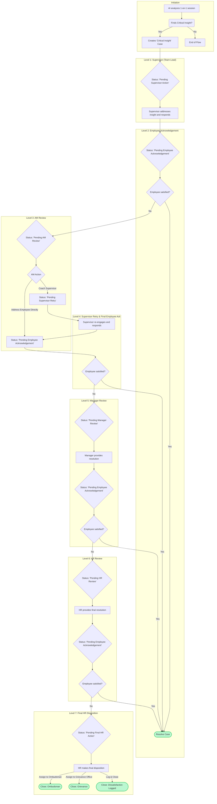

# Escalation Matrix Process Flow

This document outlines the complete escalation workflow for both AI-detected critical insights and user-submitted concerns. You can copy and paste the `mermaid` code blocks into a Mermaid.js viewer (like the one in VS Code or online) to see the visual chart.

## Path 1: AI-Detected Critical Insight from 1-on-1

This flow is triggered automatically when the AI analysis of a 1-on-1 session identifies a `criticalCoachingInsight`.



## Path 2: User-Submitted Concern ("My Concerns" Feature)

This flow starts when a user submits a concern through the "My Concerns" page. It has two primary starting points: Anonymous and Identified.

```mermaid
graph TD
    subgraph "Initiation"
        A[User opens "My Concerns"] --> B{Chooses Path};
        B -- Anonymous --> C[Submits Anonymous Concern];
        B -- Identified --> D[Submits Identified Concern to Recipient];
    end

    subgraph "Anonymous Path"
        C --> E{Status: Pending Manager Action};
        E --> F{Manager Action};
        F -- Request Identity Reveal --> G{Status: Pending Identity Reveal};
        F -- Resolve Directly --> H([Case Resolved]);
    end

    subgraph "Identity Reveal"
        G --> I{Employee Action};
        I -- Accept --> J[Status becomes Identified];
        I -- Decline --> K{Status: Pending HR Action};
        J --> D;
    end
    
    subgraph "Anonymous HR Review"
        K --> L[Manager & HR Head Review];
        L --> M[Both add resolution summaries];
        M --> H;
    end

    subgraph "Identified Path"
        D --> N{Status: Pending Supervisor Action};
        N --> O[Recipient Manager Responds];
        O --> P{Status: Pending Employee Acknowledgment};
        P --> Q{Employee satisfied?};
        Q -- Yes --> R([Case Resolved]);
        Q -- No --> S{Escalate to Next Level};
    end
    
    subgraph "Identified Escalation Chain"
        S --> T(AM Review);
        T --> U{Employee satisfied?};
        U -- Yes --> R;
        U -- No --> V(Manager Review);
        V --> W{Employee satisfied?};
        W -- Yes --> R;
        W -- No --> X(HR Head Review);
        X --> Y{Employee satisfied?};
        Y -- Yes --> R;
    end
    
    subgraph "Identified Final Disposition"
        Y -- No --> Z{Status: Final Disposition Required};
        Z --> AA[HR Head makes final decision];
        AA -- Assign to Ombudsman --> AB([Close: Ombudsman]);
        AA -- Assign to Grievance Office --> AC([Close: Grievance]);
        AA -- Log & Close --> AD([Close: Dissatisfaction Logged]);
    end

    subgraph "Retaliation Sub-Path (from any Identified Case)"
        N --> AE{Report Retaliation?};
        O --> AE;
        P --> AE;
        AE -- Yes --> AF[New Case Created];
        AF --> AG{Status: Retaliation Claim};
        AG --> AH[HR Head Investigates & Responds];
        AH --> AI{Employee satisfied with HR response?};
        AI -- Yes --> R;
        AI -- No --> AJ([Case Closed with Dissatisfaction Noted]);
    end

    classDef endPoint fill:#bbf7d0,stroke:#22c55e,stroke-width:2px;
    class H,R,AB,AC,AD,AJ endPoint;
```
